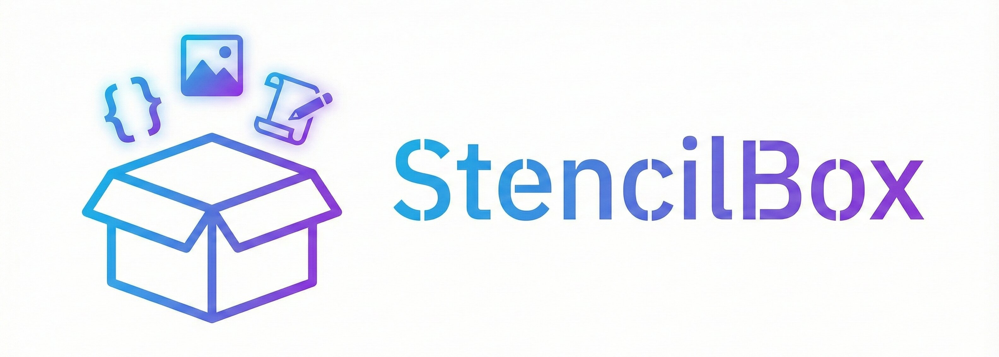

Templates, prompts, and workflows for AI-assisted creation - code, images, and writing.

## Structure

```
stencilbox/
├── home/           # Personal stencils and artifacts
│   ├── code/           # Software development templates
│   ├── images/         # Image generation prompts & workflows
│   ├── writing/        # Fiction, nonfiction, copywriting
│   ├── learning/       # Programming skill development
│   ├── projects/       # Active project-specific stencils
│   └── shared/         # Cross-domain personas & workflows
├── work/           # Work-adapted stencils
│   ├── code/           # Regulated environment engineering docs
│   └── project-planning/  # SOD workflow and prompts
└── CHANGELOG.md    # Notable repository changes
```

## Quick Start

### Code Projects (Home)

```
Read code/discovery/PROCESS.md and help me brainstorm a new project.
Read code/bootstrap/PROCESS.md and create a Python CLI project.
Read code/Coding_Human_AI_Team_Agreement.md and help me get started.
```

See [home/code/README.md](home/code/README.md) for full development workflow.

### Work (Regulated Environment)

Start with:
- `work/code/README.md` for overview and constraints
- `work/code/WORK_ENVIRONMENT.md` to document approvals and policies
- `work/project-planning/README.md` for the AI-assisted SOD and story workflow

Quick commands:
- Add notes: use `work/project-planning/snippets/sod.code-snippets` (`sodnotes`)
- View/lock SOD: `showsod` / `locksod`
- Generate stories: `sodstories`

### Image Generation

| Tool | Location |
|------|----------|
| DALL-E / ChatGPT | `home/images/prompts/dalle/` |
| Midjourney | `home/images/prompts/midjourney/` |
| Gemini / Nano Banana | `home/images/prompts/gemini/` |
| Style references | `home/images/styles/` |
| Multi-step workflows | `home/images/workflows/` |

### Writing

| Type | Location |
|------|----------|
| Fiction | `home/writing/fiction/` |
| Nonfiction | `home/writing/nonfiction/` |
| Prompts | `home/writing/prompts/` |

### Learning

Track programming skill development:

| Folder | Purpose |
|--------|---------|
| `home/learning/problem-solving/` | Algorithms, debugging, thinking frameworks |
| `home/learning/fundamentals/` | CS concepts, design patterns |
| `home/learning/journal/` | Progress tracking, reflections |

## Active Projects

| Project | Description |
|---------|-------------|
| [bowerbird](https://github.com/jayers99/bowerbird) | Photo collection to illustration generator |
| [pebble](https://github.com/jayers99/pebble) | Scrum standup helper |
| Work planning | See `work/project-planning/` for SOD and story workflow |

## Shared Resources

- **Personas** (`home/shared/personas/`) - AI personalities for different tasks
- **Workflows** (`home/shared/workflows/`) - Cross-domain processes

## Philosophy

Stencils, not scaffolds. These are patterns to trace, not structures to fill. Use them as starting points, adapt freely, discard what doesn't fit.
